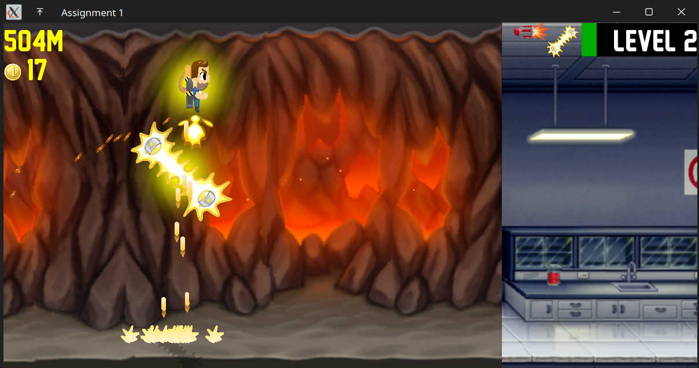
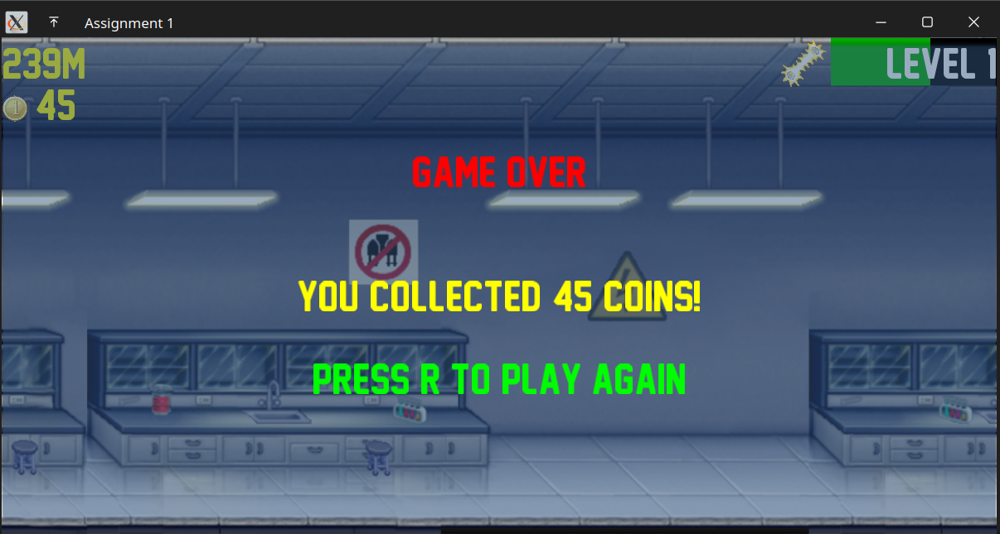

# Jetpack Joyride Clone
Made as part of Computer Graphics Assignment 1

## Contents
- `libraries`: glfw, glad and glm built from source
- `include`: shader class from [learnopengl.com](learnopengl.com) and `stb_image.h`
- `src`: source files
- `textures`: textures used in the project
- `shaders`: shaders used in the project
- `assets`: sprites, spritesheets and sounds used in the project
- `fonts`: fonts used in the project
- `CMakeLists.txt`: cmake file
- `README.md`: this file

## Requirements
- GLFW
- GLAD
- GLM
- IrrKlang (for sound)

NOTE: The above libraries should included in the project (in the `libraries` folder) and are built from source.

- CMake
- OpenGL
- FreeType (for fonts)

## Compiling and running
`cmake . && make && ./app`

## How to play

### Controls

`SPACE` - Activate Jetpack

### Objective

Collect most of the coins and reach the end of the level.

### Enemies

1. Zapper
	- Can be rotating, horizontal or vertical

2. Laser
	- Can be one or two
	- Occupies the entire width of the screen
	- Takes time to recharge

3. Missile
	- Aims at the player
	- Can be one or two

### Powerups

TODO

### Jetpack types

TODO

### Levels

TODO: Better level design

## Screenshots

TODO

## References

- [learnopengl.com](learnopengl.com)

## Author

	Soham Korade
	2021101131
